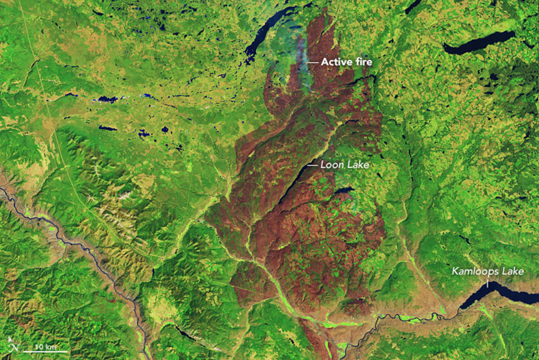

My 599 project focuses on forest recovery after wildfires, using the 2017 Elephant Hill wildfire as a case study. 
The project analyzes Landsat 8 satellite data, including B5, NBR, and NDVI, to assess vegetation recovery over a five-year period, comparing post-fire conditions to pre-fire baselines. 
The goal is to identify areas with slow recovery and determine factors such as fire severity, terrain, and climate that influence regeneration.

## github-tutorial
Hello! This is the testing repo for 599 where students will submit their test branch 🚀

Now that you're here...
Please follow the steps below: 

1. Clone the GitHub Repo to your local computer using method of choice (GitHub Desktop, command line etc.) 
2. Create a new Branch called "LASTNAME_FIRSTNAME_branch"
3. Publish your new Branch - say "yes I want to make this a fork" since you won't have write access to the repo
4. Set up a file organization structure for a new project
5. Add a README file called "README_LASTNAME_FIRSTNAME.md" and write a brief description that you could use for your 599 project - If you already have one.. Great! Make it better in some way and submit that (add a photo? Change the font? add in your contact info?)
6. Commit changes
7. Push Changes to remote origin
8. Take a screenshot of your GitHub forked repo with your README and template folders 
9. You will receive a participation grade based on the existence of this branch with your README :) 

**You will receive a participation grade based on the existence of this branch with your README :)**

testing commmits
